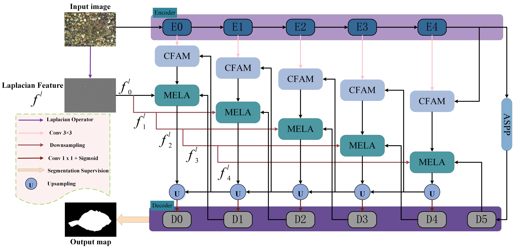

# MELANet: Multi-Scale Edge Location-Aware Attention Network for Camouflaged Object Detection

## 项目简介
MELANet 是面向伪装目标检测的深度学习模型，通过多尺度边缘位置感知注意力机制提升检测精度。

## 模型架构
### 1. MELANet 整体架构

*图 1：MELANet 整体架构，基于 U 型结构融合多尺度边缘特征*

### 2. MELA 模块细节

*图 2：MELA（Multi-Scale Edge Location-Aware）模块，无参数拉普拉斯金字塔结构*

## 结果掩码下载
链接: https://pan.baidu.com/s/1rzk1WBFVKqmhsjeINYN04w 提取码: HDWT

## 环境配置
# ... 其余内容不变
