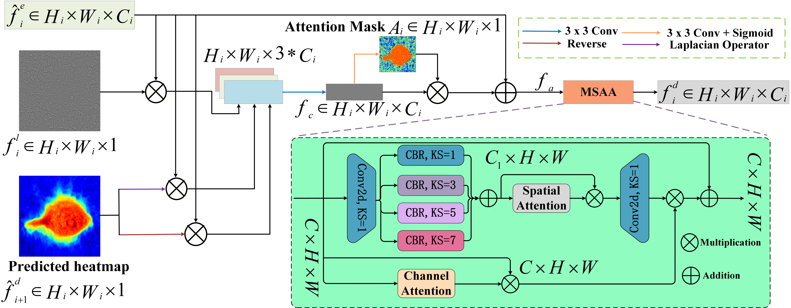
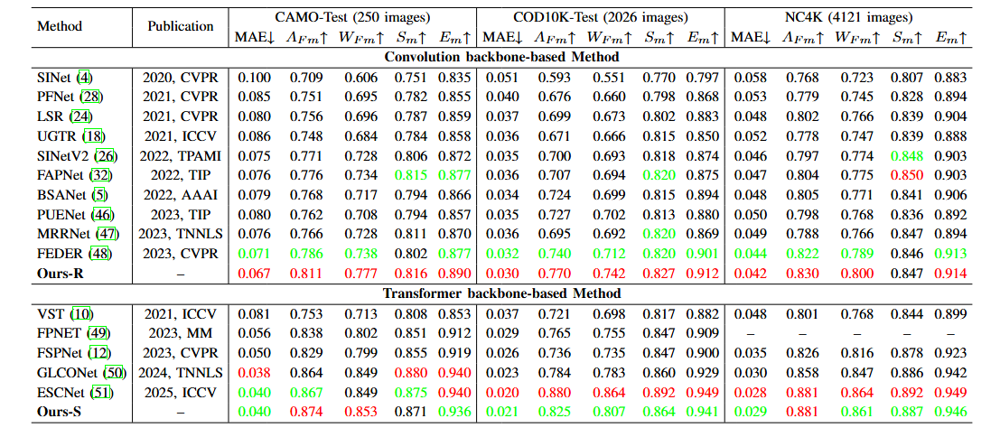
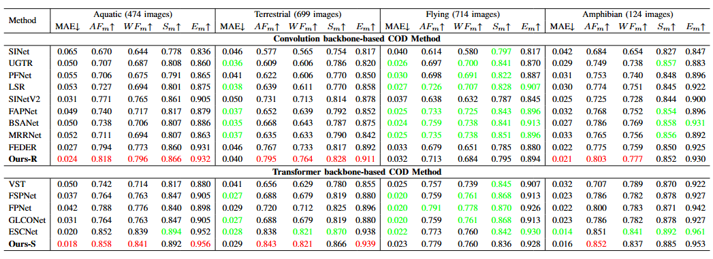
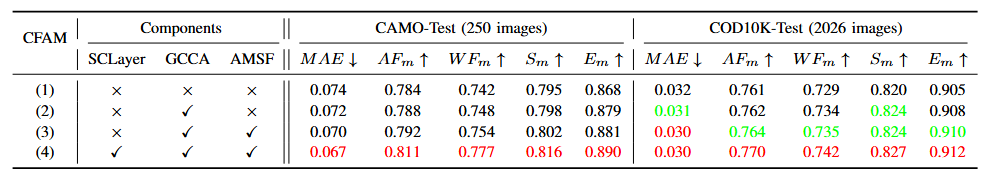
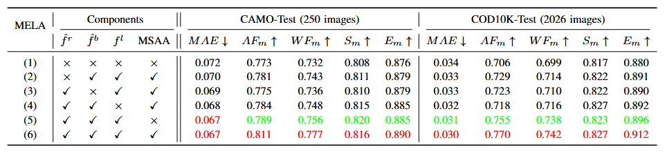

# MELANet: Multi-Scale Edge Location-Aware Attention Network for Camouflaged Object Detection

## 项目简介
  MELANet（多尺度边缘位置感知注意力网络）是一款针对伪装物体检测（COD）任务的高性能深度学习模型，旨在解决当前 COD 领域中因高频边界细节衰减、跨层语义错位导致的物体定位不稳定、分割轮廓模糊及背景泄漏等核心问题。
  在伪装物体检测场景中，目标物体因视觉上与环境高度融合，且边界易被背景纹理破坏，传统基于 CNN 或 Transformer 的方法虽通过多尺度表示学习、全局建模取得了一定进展，但普遍忽视了高频边界细节在深度编码和跨级融合中逐渐衰减平滑的关键瓶颈。为此，MELANet 从两大核心模块入手突破这一限制：一是设计无参数的多尺度边缘定位感知注意力（MELA）模块，借助拉普拉斯金字塔提取多尺度边缘线索并注入解码器特征，精准恢复边界敏感的高频信息，实现物体边界细化；二是提出情境特征聚合模块（CFAM），整合多尺度上下文信息与全局依赖关系，有效减轻跨层语义错位问题，提升特征融合的准确性。
  在 COD10K、CAMO、NC4K 三大主流 COD 数据集的测试中，MELANet 在五个标准评价指标上均展现出极具竞争力的性能，且多项指标优于现有方法，为伪装物体检测提供了更精准、稳定的解决方案。

## 模型架构
### 1. MELANet 整体架构

*图 1：MELANet 整体架构，基于 U 型结构融合多尺度边缘特征*

### 2. MELA 模块细节

*图 2：MELA（Multi-Scale Edge Location-Aware）模块，无参数拉普拉斯金字塔结构*

## 结果
### 1. Quantitative results on three COD benchmark datasets

*图 1：Quantitative results on three COD benchmark datasets. The best results are highlighted in red and green. The symbols
“↑ / ↓” indicate that higher/lower values are better, respectively. Note that “Ours-R” and “Ours-S” use Res2Net-50 and Swin
Transformer as the backbone, respectively.*

### 2. Quantitative results on the COD10K of other four classes

*图 2：Quantitative results on the COD10K of other four classes (i.e., “Aquatic”, “Terrestrial”, “Flying”, and “Amphibian”).
The best two results are shown in red and green.*

### 3. CFAM configuration and quantitative results on CAMO and COD10K

*图 3：CFAM configuration and quantitative results on CAMO and COD10K. Best results are highlighted in red.*

### 4. MELA configuration and quantitative results on CAMO and COD10K

*图 4：MELA configuration and quantitative results on CAMO and COD10K. Best results are highlighted in red.*

## 结果掩码下载
链接: https://pan.baidu.com/s/1rzk1WBFVKqmhsjeINYN04w 提取码: HDWT

